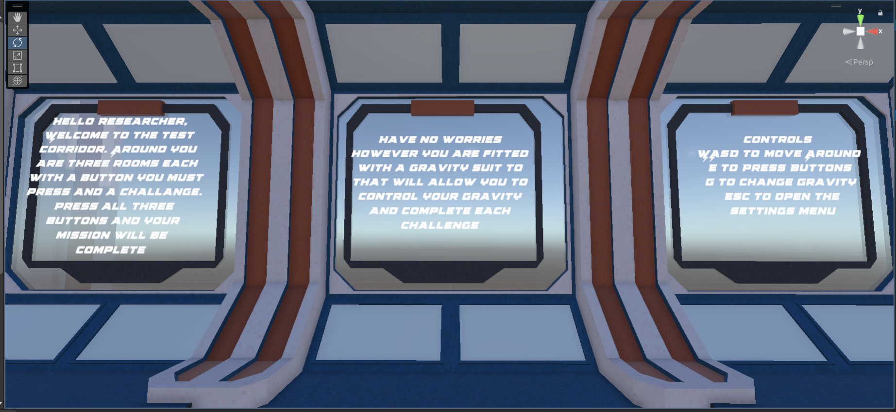

# 🚀 CS134 Project – Gravity Mission

## 🎮 Overview
**Gravity Mission** is a 3D puzzle game built in Unity where the player must complete three unique missions inside a futuristic space facility.  

Each mission challenges a different skill:
- Spatial awareness
- Timing and pattern recognition
- Movement and obstacle navigation  

The player can complete missions in **any order**, and the game concludes once all objectives are completed.

---

## 🕹️ Controls

| Action | Key |
|------|-----|
| Move | WASD |
| Interact / Press Button | E |
| Toggle Gravity | G |
| Open Settings | ESC |

---

## 🧠 Gameplay Flow

At the start of the game, the player is placed in a central corridor with instructions displayed on the walls.

> “Around you are three rooms. Each contains a challenge. Press all three buttons to complete your mission.”

Each room contains:
- A **mission completion button**
- A **unique gameplay mechanic**
- A **completion condition**

---

## 🟪 Mission 1 – Hidden Button (Easy)

**Objective:**  
Find and press a hidden button inside the room.

**Mechanic:**  
- The player must use a **gravity-switching ability** to navigate over obstacles.
- Glass walls block the path, requiring the player to:
  - Press **G** to flip gravity
  - Move across surfaces
  - Press **G again** to return to normal

**Goal:**  
Locate the hidden button, press it, and return to the main corridor.

---

## 🔷 Mission 2 – Laser Sigil Puzzle (Medium)

**Objective:**  
Match rotating lasers to symbolic shapes.

**Mechanic:**
- Player presses a button to start the puzzle
- Lasers begin **rotating continuously**
- Player presses **E** at the right moment when:
  - The laser pattern aligns with a symbol on the wall/floor

**Key Features:**
- Five target shapes (square, star, cross, octagon, rays)
- Alignment only needs to be within a **tolerance range**

**Goal:**
- Match **all target shapes**
- Unlock and press the completion button

---

## 🔴 Mission 3 – Laser Obstacle Course (Hard)

**Objective:**  
Reach the end of a hallway filled with laser traps.

**Mechanic:**
- Moving and static laser grids block the path
- Player must:
  - Carefully time movements
  - Avoid all lasers

**Failure Condition:**
- Touching any laser resets the player to the start

**Goal:**
- Successfully navigate the course
- Press the final button at the end

---

## 🏁 Game Completion

Once all three mission buttons are pressed:

> ✅ **MISSION ACCOMPLISHED**

A completion message appears, signaling the end of the game.

---

## 🧩 Features

- Modular puzzle design
- Physics-based gravity switching
- Timing-based interaction system
- Laser rotation and alignment logic
- Visual feedback for puzzle progression
- Reset systems for failure conditions

---

## 🛠️ Built With

- Unity (2022.3.62f3)
- C#
- Custom scripts for:
  - Player interaction
  - Laser rotation systems
  - Puzzle management logic

---